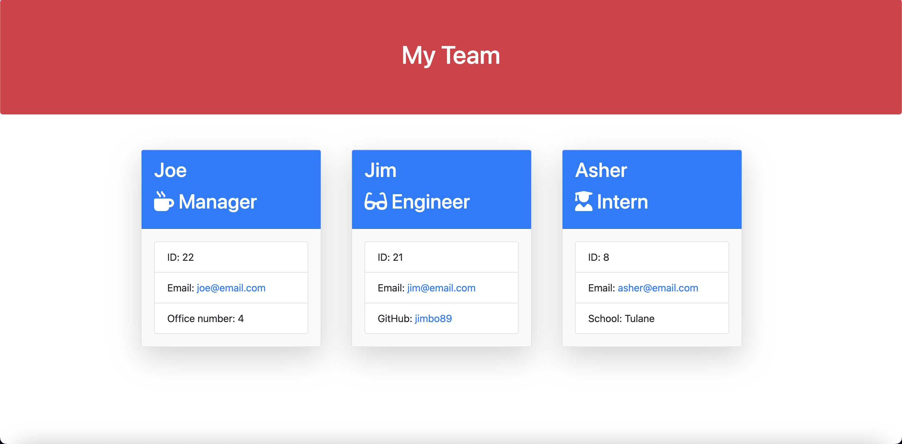

# team-profile-generator

## Description

This project generates a webpage that displays a team's members as cards. These cards include basic info such as a name, id number, email, and role. There are three possible roles to assign to a team member, which include manager, engineer, and intern.

This application uses Jest to run unit test, and Inquirer to collect user input.

## Installation

Clone the repository to your local machine.

Visit the official [Node.js website](https://nodejs.org/en/) and follow the instructions to download.

Then install the inquirer npm package in your command line using the following command:

` $ npm install `

To install Jest to run the unit tests, type into your command line:

` $ npm install --save-dev jest `

## Usage

Open the folder in integrated terminal by right clicking and selecting the drop down option.

In the terminal run `npm test` to see if the test suite passes, and then run `node index.js` to start the program.

You will then be prompted with a series of questions pertaining to the members of your team. This line of questioning will continue until you select 'No more employees to add'.

Once the program is finished running, it will export your inputted data to the **output.html** file located in the **dist** folder. Right click on the file and select **Open in Default Browser** to view.

[Click here to watch a demonstration](https://drive.google.com/file/d/1f5lnMv--6Cv21WOkP3DfvvABiAiDmRfr/view)

## Credits

Credit to the super awesome team of instructors at the UW Full-Time Online Coding Boot 2022.